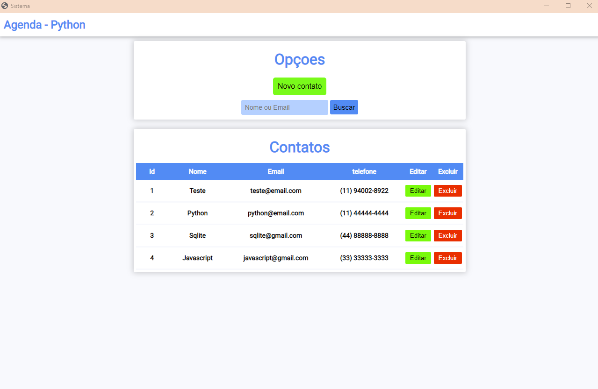

# Agenda de contatos 



> Sistema agenda desktop desenvolvido em python utilizando biblioteca eel e sqlite.

### Ajustes e melhorias

## 💻 Pré-requisitos

Antes de começar, verifique se você atendeu aos seguintes requisitos:
<!---Estes são apenas requisitos de exemplo. Adicionar, duplicar ou remover conforme necessário--->
* python 3.10 ou superior

* biblioteca python eel 
```
pip install eel
```

* Biblioteca python pyautogui  

```
pip install pyautogui
```


## 🚀 Executando o projeto

Para usar a agenda, siga estas etapas:

Caso não haja o arquivo **contatos.db** na raiz do projeto executar o arquivo **database.py**:
```
python database.py
```

Após a mensagem **Tabela criada com sucesso.**

Basta executar o aruivo **main.py**:
```
python main.py
```

## 📝 Sobre

Esse projeto foi realizado para um trabalho do curso de Informática do **IFPI** - IFPI Instituto Federal do Piauí.
Trabalho feito por Bruno Lopes Silva.

[⬆ Voltar ao topo](#Agenda-de-contatos)<br>
